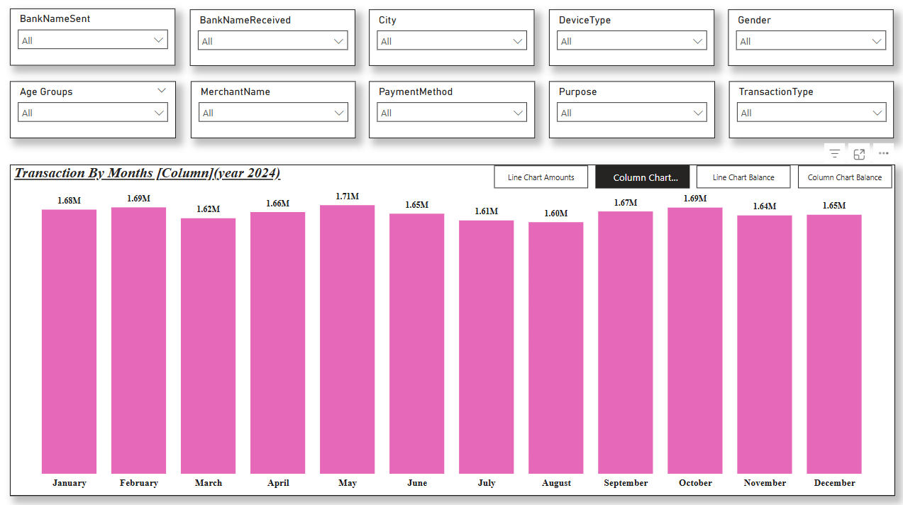

# UPI Transaction Data Analysis - Power BI Project

## Overview

This Power BI project analyzes UPI transaction data for the year 2024, providing insights into transaction trends, amounts, and patterns. The dashboard includes various filters and visualizations to help users explore the dataset effectively.

## Features

- **Interactive Filters:** Users can filter data by:
  - Bank Name (Sent & Received)
  - City
  - Device Type
  - Gender
  - Age Groups
  - Merchant Name
  - Payment Method
  - Purpose
  - Transaction Type
- **Visualizations:**
  - **Bar Chart:** Displays monthly transaction amounts in millions.
  - **Line Chart:** Alternative visualization for tracking transaction amounts and balances over time.
  - **Comparison Charts:** Users can switch between column and line charts for better insights.

## Dashboard Preview

## Data Sources

The dataset consists of UPI transactions recorded throughout 2024, capturing essential details such as transaction amounts, banks involved, and customer demographics.

## Usage

1. Open the Power BI dashboard.
2. Use the filters to refine the dataset based on specific parameters.
3. Explore trends using different visualization options.
4. Gain insights into transaction volumes and variations across different months.

## Insights & Key Findings

- **Transaction Trends:** Highest transaction volume observed in May (1.71M transactions), while August recorded the lowest (1.60M transactions).
- **Consistent Growth:** Transaction amounts remain fairly stable across months, with slight fluctuations.
- **User Demographics & Behavior:** Further analysis can help identify trends based on age groups, gender, device types, and payment methods.

## Future Enhancements

- **Detailed Merchant Analysis:** Breakdown of transactions by merchant category.
- **Geographical Insights:** Mapping transaction trends across cities.
- **Fraud Detection Indicators:** Identify unusual transaction patterns.

## Technologies Used

- **Power BI** for data visualization and dashboard creation.
- **UPI Transaction Dataset** for data analysis.
- **DAX (Data Analysis Expressions)** for custom calculations.

